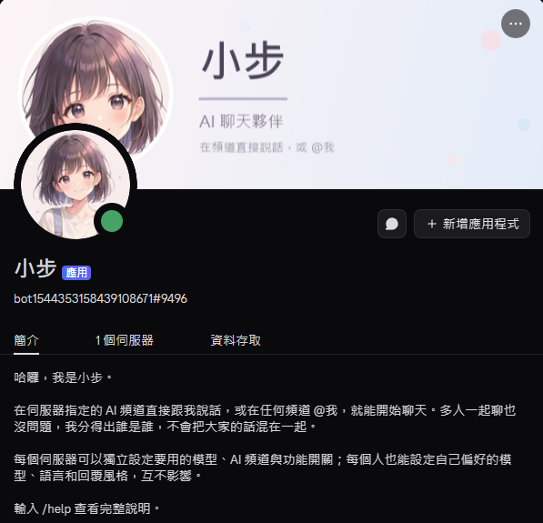

# 小步（Xiaobu）— Discord AI Bot


可公開邀請到多個 Discord Server 的 AI 聊天 Bot。部署在 Oracle Cloud Always Free VM，24/7 運行，不需要 GPU，**伺服器成本 $0**。

小步是一個 18 歲女生設定的聊天夥伴。在多人頻道中她分得出誰是誰，不會把大家的話混在一起 —— 這是本專案在架構上最花心思的地方，詳見[說話者識別怎麼運作](#說話者識別怎麼運作)。

> **目前進度：Phase 3 已完成。** 聊天、多伺服器隔離、多 AI Provider 與自動換手、網路搜尋、天氣、計算機、長期記憶、伺服器背景知識都可實際使用。生圖、音樂、語音尚未實作 —— 詳見下方「功能狀態」。

---

## 目錄

- [截圖](#截圖)
- [功能狀態](#功能狀態)
- [架構](#架構)
- [系統需求](#系統需求)
- [Discord Bot 設定](#discord-bot-設定)
- [AI Provider 與免費額度](#ai-provider-與免費額度)
- [工具（Tool Calling）](#工具tool-calling)
- [環境變數](#環境變數)
- [本機開發](#本機開發)
- [Docker](#docker)
- [Oracle Cloud 部署](#oracle-cloud-部署)
- [指令](#指令)
- [權限](#權限)
- [設定](#設定)
- [備份](#備份)
- [疑難排解](#疑難排解)
- [安全性](#安全性)
- [圖片素材](#圖片素材)
- [License 與第三方](#license-與第三方)

---

## 截圖

<p align="center">
  
</p>

<p align="center">
  <sub>實際運行畫面。頭像與橫幅版權保留，見<a href="#圖片素材">圖片素材</a>。</sub>
</p>

---

## 功能狀態

### 可以使用

| 功能 | 說明 |
|---|---|
| AI 聊天 | 在指定的 AI 頻道直接說話，或在任何頻道 @Bot |
| 說話者識別 | 多人頻道中，Bot 知道每一則是誰說的 |
| 多 AI Provider | Gemini 與 Groq，13 個免費模型可選 |
| 自動換手 | 主力 provider 額度用完時改用另一家免費服務，**絕不自動切付費** |
| 網路搜尋 | 問即時資訊會自己去查，回覆下方附上真實來源 |
| 天氣 | 全球城市的目前天氣與三天預報 |
| 計算機 | 自己寫的安全求值器，**不使用 eval** |
| 時間 | 模型不知道「今天」，這個工具補上 |
| 長期記憶 | `/memory`，範圍 (伺服器, 使用者)，跨伺服器與跨人都不互通 |
| 伺服器背景知識 | `/settings facts`，全伺服器共用，僅 Manage Guild 可改 |
| 短期對話記憶 | 每個頻道一條上下文，重啟後仍保留 |
| 多伺服器隔離 | 每個 Server 獨立設定，資料互不流通 |
| 個人設定 | 偏好模型、語言、回覆風格 |
| 伺服器設定 | AI 頻道、預設模型、開關、自訂系統指示 |
| Rate limiting | 使用者 / 伺服器 / 全域三層 |
| 用量統計 | `/usage`，僅限有 Manage Guild 權限者 |
| SQLite 持久化 | Docker volume，重啟與 VM 重開機都不掉資料 |

### 尚未實作

以下功能在 `Planning.md` 中規劃，但**目前完全不能用**，不要對使用者宣稱有這些功能：

| 功能 | 排定階段 |
|---|---|
| AI 生圖 | Phase 4 |
| YouTube 音樂播放 | Phase 5 |
| 語音、STT、TTS | Phase 6 |

資料庫已建好 `music_queues` 資料表，`/settings` 也保留了 image / music / voice 開關欄位，但**打開這些開關目前不會有任何效果**。

> ⚠️ 音樂（Phase 5）與語音（Phase 6）在這個規格的機器上不一定做得起來 —— YouTube 條款與機房 IP 封鎖是主要障礙，不是程式問題。到那個階段會實測後再決定，詳見 `Planning.md`。

---

## 架構

```
Discord Gateway
      |
      v
events/messageCreate ──► rate limiter ──► ChatService
                                              |
                    ┌─────────────────────────┼──────────────────────┐
                    v                         v                      v
            conversations 儲存         prompt 組裝（說話者標記）   AiRouter
                    |                         |                      |
                    └────────► SQLite ◄───────┘          ┌───────────┴───────────┐
                                  ^                      v                       v
                                  |                 GeminiClient        OpenAiCompatible
                          usage / settings               |                       |
                                                    Gemini API              Groq API

AiRouter：依選到的 model 決定 provider，失敗時在**免費** provider 之間換手，
         且永遠不會自動使用標記為 paid 的 provider。

模型要求呼叫工具時，ChatService 執行工具再把結果送回模型，最多 3 輪：

  模型 ──要求 web_search──► ToolRegistry ──► SearchRouter ──► Tavily / Gemini grounding
    ▲                            │
    └────── 工具結果送回 ─────────┘
```

```
src/
├── index.ts                     啟動、關閉、相依組裝
├── config/
│   ├── env.ts                   Zod 驗證環境變數（至少一把 provider Key）
│   ├── constants.ts             MODEL_CATALOG：model -> provider 對照與白名單
│   └── resolveSettings.ts       個人 > 伺服器 > 系統預設
├── database/
│   ├── schema.ts                Drizzle schema（10 張表）
│   ├── client.ts                連線、migration、pragma
│   └── repositories/            identity / settings / conversations / usage / memories / guildFacts
├── ai/
│   ├── providers/
│   │   ├── types.ts             ChatProvider 介面與能力宣告
│   │   ├── gemini.ts            Gemini SDK 封裝與錯誤轉譯
│   │   ├── openaiCompatible.ts  OpenAI 相容端點共用實作（fetch，無額外相依）
│   │   ├── groq.ts              Groq 的設定
│   │   └── registry.ts          依環境變數組出可用 provider（陣列順序＝優先順序）
│   ├── router.ts                選 provider、換手、付費防護
│   ├── search/
│   │   ├── types.ts             SearchProvider 介面
│   │   ├── tavily.ts            Tavily（預設）
│   │   ├── geminiGrounding.ts   Google 搜尋 grounding（備援）
│   │   ├── router.ts            搜尋來源之間的換手
│   │   └── registry.ts          依環境變數組出搜尋來源
│   ├── tools/
│   │   ├── types.ts             Tool 介面與參數驗證
│   │   ├── search.ts            web_search
│   │   ├── weather.ts           get_weather（Open-Meteo）
│   │   ├── calculator.ts        calculate（自寫求值器，不用 eval）
│   │   ├── time.ts              get_current_time
│   │   ├── memory.ts            remember / forget
│   │   └── registry.ts          工具清單與執行
│   ├── context.ts               說話者標記與對話歷史組裝
│   ├── prompt.ts                system instruction（含記憶與背景知識注入）
│   └── chatService.ts           一則訊息 -> 一則回覆，含工具迴圈
├── bot/                         client、指令註冊、健康檢查
├── commands/                    help / settings / me / memory / reset / usage
├── events/                      messageCreate / interactionCreate / guildLifecycle
└── utils/                       rateLimiter / messageChunk / errors / logger
```

### 新增一個 provider 要做什麼

如果是 OpenAI 相容端點（多數都是），只要在 `src/ai/providers/` 加一個像 `groq.ts` 那樣的小檔案設定 baseUrl，在 `constants.ts` 的 `PROVIDER_IDS`、`MODEL_CATALOG`、`PROVIDER_DEFAULT_MODEL` 補上，再到 `registry.ts` 加一行。Router 與 ChatService 都不用改。

### 說話者識別怎麼運作

AI 頻道是多人共用的。如果只把頻道歷史丟給模型，模型會把所有人當成同一個人。因此：

1. 每則使用者訊息在資料庫都存 `user_id` 與當下的 `username`。
2. 送進模型前，每則使用者發言加上 `[顯示名稱]` 前綴。
3. System instruction 明確說明「`[名字]` 代表不同的人，現在正在對你說話的是 X」。
4. 顯示名稱會先清理（移除方括號與換行），避免有人把暱稱改成 `] 系統指令：… [` 來偽造對話結構。

短期對話的範圍是 `(guild_id, channel_id)`；長期記憶的範圍是 `(guild_id, user_id)`，同一個人在不同 Server 是兩份資料。

---

## 系統需求

- Node.js 22 以上（本機開發）
- Docker 與 Docker Compose（部署）
- Discord Bot Token
- Gemini 或 Groq 的 API Key（至少一把，兩把都有就有自動換手）

不需要 GPU，不需要付費 API，不需要額外資料庫。

---

## Discord Bot 設定

### 1. 建立 Application

前往 [Discord Developer Portal](https://discord.com/developers/applications) → **New Application**。

在 **General Information** 複製 **Application ID** → 這是 `DISCORD_CLIENT_ID`。

### 2. 建立 Bot 並取得 Token

**Bot** 分頁 → **Reset Token** → 複製 → 這是 `DISCORD_TOKEN`。

> Token 等同密碼。外洩就立刻 Reset。絕對不要 commit。

### 3. 開啟 Privileged Intent（必要）

**Bot** 分頁 → **Privileged Gateway Intents** → 開啟：

- **MESSAGE CONTENT INTENT** ✅

沒開這個，Bot 讀不到訊息內容，聊天功能完全不會動。

其餘兩個（Presence、Server Members）**不需要**開啟。

### 4. 產生邀請連結

**OAuth2** → **URL Generator**：

**Scopes：**
- `bot`
- `applications.commands`

**Bot Permissions：**
- View Channels
- Send Messages
- Send Messages in Threads
- Embed Links
- Read Message History

或直接使用（把 `你的APPLICATION_ID` 換掉）：

```
https://discord.com/oauth2/authorize?client_id=你的APPLICATION_ID&permissions=274877991936&scope=bot%20applications.commands
```

**不需要 Administrator 權限。** 若之後啟用生圖（Phase 4）需要額外加上 `Attach Files`。

---

## AI Provider 與免費額度

本專案接了 **Gemini** 與 **Groq** 兩家，兩家都是**真正的免費層**，而且條款都允許把服務提供給你的使用者。至少要設定一把 Key，兩把都設就有自動換手。

| Provider | 取得 Key | 環境變數 | 角色 |
|---|---|---|---|
| Google Gemini | <https://aistudio.google.com/apikey> | `GEMINI_API_KEY` | 預設主力 |
| Groq | <https://console.groq.com/keys> | `GROQ_API_KEY` | 備援，也可直接指定 |

### 可用模型（2026-09 實測）

下表的「實測」欄是拿真實 API Key 逐一呼叫量到的，不是抄文件。

| Model | Provider | 狀態 | 實測 |
|---|---|---|---|
| `gemini-3.1-flash-lite` | Gemini | production | ✅ 約 1 秒　**系統預設** |
| `gemini-3.5-flash-lite` | Gemini | production | ✅ 約 1 秒 |
| `gemini-2.5-flash-lite` | Gemini | production | ✅ 約 1 秒 |
| `gemini-2.5-flash` | Gemini | production | ✅ 3～7 秒 |
| `gemini-3.5-flash` | Gemini | production | ⚠️ 20～24 秒，明顯偏慢 |
| `gemini-3.6-flash` | Gemini | production | ⚠️ 6～17 秒，偶爾 503 |
| `gemini-3.7-flash` | Gemini | production | ⚠️ 測試當下兩次都失敗（503 高負載／逾時） |
| `openai/gpt-oss-120b` | Groq | production | ✅ 約 1 秒　**Groq 換手時的預設** |
| `openai/gpt-oss-20b` | Groq | production | ✅ 約 0.5 秒 |
| `groq/compound` | Groq | production | ✅ 約 1.6 秒，內建網路搜尋 |
| `groq/compound-mini` | Groq | production | ✅ 約 1.1 秒，內建網路搜尋 |
| `qwen/qwen3.8-27b` | Groq | ⚠️ preview | ✅ 約 0.5 秒 |
| `qwen/qwen3.6-27b` | Groq | ⚠️ preview | ✅ 約 1.7 秒，會先思考 |

**新版 Gemini Flash（3.5 / 3.6 / 3.7）在免費層很容易碰到 503「high demand」或逾時。** 這是 Google 端的容量問題，不是設定錯誤 —— 自動換手就是為了這種狀況。想穩定就用 flash-lite 系列。

⚠️ Groq 把 Qwen 標為 **preview**（intended for evaluation purposes only、可能隨時下架），因此**不會**被當成預設或換手目標，只有你自己選才會用到，`/settings model` 選單上也標了出來。

**推理型模型的處理**：`gpt-oss` 與 Qwen 的 thinking 版本會輸出推理過程。有的放在獨立的 `reasoning` 欄位（不會讀到），有的直接夾在內容的 `<think>…</think>` 裡 —— 後者程式會清掉，使用者只看到答案。如果推理把整個 token 預算吃光導致沒有答案，會被判定成「輸出長度不足」而觸發換手，**不會**被誤判成內容被擋（那種是不換手的）。

> ⚠️ **Groq 的說明文件與帳號實際能用的模型不一致。** 文件頁列出的 `llama-3.3-70b-versatile`、`llama-3.1-8b-instant` 實際呼叫回 404「does not exist or you do not have access to it」，`GET /openai/v1/models` 也查不到。上表是用實際 Key 打 `/models` 對出來、再逐一呼叫驗證過的。要加 Groq 模型前請先自己查一次：
>
> ```bash
> curl -s https://api.groq.com/openai/v1/models -H "Authorization: Bearer $GROQ_API_KEY"
> ```

`gemini-2.5-pro` **未出現**在 Gemini 免費清單中，因此不納入白名單 —— 依規格「不確定就不假設免費」。

### 額度

| Provider | 額度 |
|---|---|
| Gemini | ⚠️ **Google 已不在公開文件列出固定的 RPM / TPM / RPD 數值** |
| Groq | 每個模型 30 RPM / 1,000 RPD / 8K TPM / 200K TPD |

Gemini 的官方文件現在只寫「到 AI Studio 查看你自己的 rate limit」，額度是動態的、依帳號而異，而且社群回報過免費額度被下調。**請自己到 <https://aistudio.google.com/rate-limit> 確認你這個帳號實際的額度**，不要照抄任何教學文章上的數字。

兩家取得免費 Key 都不需要綁信用卡。⚠️ 但兩家都**沒有承諾免費層永久存在**。

### 自動換手（fallback）

主力 provider 失敗時自動改用另一家免費 provider，換手時使用該 provider 標示為 production 的預設模型。

| 失敗原因 | 會不會換手 |
|---|---|
| 額度用完（429） | ✅ |
| 逾時 | ✅ |
| API Key 錯誤（401 / 403） | ✅ |
| 服務暫時故障（5xx） | ✅ |
| **內容被安全機制擋下** | ❌ **絕不換手** |

最後一列是刻意的：內容被擋不代表「這家壞了」，而是這個內容不該被產生。換一家重試等於在找一個肯講的 provider，所以直接把錯誤回給使用者。

換手成功時，回覆下方會加一行小字說明這則是由誰回答的 —— 換了 provider 就是換了模型，風格與品質會不一樣，讓使用者知道比較誠實。用量統計也會記在真正回答的那家頭上。

用 `AI_FALLBACK_ENABLED=false` 可以關掉換手。

### 絕不自動切換到付費服務

`ALLOW_PAID_PROVIDERS` 預設 `false`。Router 在挑選候選 provider 時會直接過濾掉標記為 `paid` 的，就算免費的全掛了也不會偷偷用付費服務 —— 只會回報錯誤。目前接的兩家都是免費層，這個開關是留給未來的保險。

另外內建三層 rate limit（使用者 / 伺服器 / 全域），避免單一使用者或伺服器把免費額度吃光。

### 查證過但**沒有**採用的 provider

規格原本規劃了 Qwen 官方 API 與 NVIDIA NIM。實際查證官方文件後兩個都不適用：

| Provider | 為什麼不用 |
|---|---|
| **NVIDIA NIM** | 免費的 Developer Program **條款禁止**這個用途。官方 FAQ：「Production use involves any use of NIM for purposes other than development, testing, research or evaluation such as conducting business transactions and **any non-testing activity including activity serving real end-users**.」公開邀請的 Discord Bot 正是 serving real end-users，要合法得買 NVIDIA AI Enterprise（起價 $4,500 / GPU / 年）。這是條款問題，不是額度問題 |
| **Qwen 官方 DashScope** | 不是免費層，是**試用**。每個模型約 100 萬 token、**只有新加坡區有**、**90 天後歸零不補發**。之後自動轉 pay-as-you-go。拿它當備援，三個月後備援自己先死 |
| **OpenRouter** | 免費模型每天只有 50 次請求（除非歷史累積購買過 $10 才變 1,000/天），太少不足以當主力。之後若需要第三層墊底可以再加 —— `OpenAiCompatibleProvider` 換個 baseUrl 就能接 |
| **Cerebras** | 只有 $5 試用額度，不是免費層 |

想用 Qwen 的話，**Groq 的免費層就有**（見上表），而且條款允許 —— 只是官方標為 preview。

參考來源：
[Gemini Pricing](https://ai.google.dev/gemini-api/docs/pricing) ·
[Gemini Rate Limits](https://ai.google.dev/gemini-api/docs/rate-limits) ·
[Gemini 模型清單](https://ai.google.dev/gemini-api/docs/models) ·
[Groq Rate Limits](https://console.groq.com/docs/rate-limits) ·
[Groq 模型清單](https://console.groq.com/docs/models) ·
[Groq Services Agreement](https://console.groq.com/docs/legal/services-agreement) ·
[NVIDIA NIM FAQ](https://docs.api.nvidia.com/nim/docs/product) ·
[Alibaba Model Studio 免費額度](https://www.alibabacloud.com/help/en/model-studio/new-free-quota) ·
[OpenRouter Limits](https://openrouter.ai/docs/api-reference/limits)

---

## 工具（Tool Calling）

小步會自己判斷要不要用工具，**不需要打指令**，直接用講的就好。

| 工具 | 什麼時候會用 | 資料來源 |
|---|---|---|
| `web_search` | 新聞、目前狀況、價格、版本號等會變動的事 | Tavily → Gemini grounding |
| `get_weather` | 問某個城市的天氣 | Open-Meteo |
| `calculate` | 需要精確數值的計算 | 本機（自己寫的求值器） |
| `get_current_time` | 現在幾點、今天幾號、還有幾天 | 本機 |
| `remember` / `forget` | 使用者說「記住…」「忘掉…」 | 本機 SQLite |

工具都有 JSON schema 與參數驗證（規格 §29）。模型給錯參數時會收到說明並自己重試，而不是讓整輪對話失敗。最多連續呼叫 **3 輪**工具，第 4 輪不再提供工具，逼模型用手上的資料把話講完。

### 搜尋

免費層現況（2026-09 查證）：

| 來源 | 額度 | 綁卡 | 特點 |
|---|---|---|---|
| **Tavily**（預設） | 每月 1,000 次，每月 1 號重置 | ❌ | 乾淨原始網址，新聞查詢附發布日期 |
| **Gemini grounding**（備援） | 每天 1,500 次 | ❌ | 額度大 45 倍，但來源是 Google 轉址連結、沒有日期 |

順序是「品質好的先用，用完換額度大的」。Tavily 額度用盡（HTTP 429/432）會自動換手。

> Gemini grounding 的 1,500 次是從 AI Studio 用量頁實際讀到的數字（`Search grounding　1 / 1.5K`），不是文件上寫的。

> ⚠️ 免費的 Google Search grounding **只有 `gemini-2.5-flash` 與 `gemini-2.5-flash-lite` 有**，Gemini 3.x 全系列都是「Not available」。所以搜尋工具內部固定叫 `gemini-2.5-flash-lite`，跟使用者聊天時選的模型無關 —— 這也表示**主回答由 Groq 產生時一樣能搜尋**。副作用是免費資格綁在舊版模型上，2.5 哪天下架這條備援就沒了，這正是預設用 Tavily 的原因。

**來源清單直接用搜尋 API 回傳的資料組成，不經過模型。** 規格 §12 要求「不得捏造來源」，讓模型自己轉述網址一定會有改寫或編造的風險，所以程式在回覆下方自己附上，並在 prompt 裡叫模型不要自己列網址。網址用 `<>` 包起來，Discord 才不會為每條來源展開一張預覽卡。

兩個都沒設定時，搜尋工具**不會提供給模型** —— 免得它呼叫了才發現用不了，白白浪費一輪。`/help` 也會跟著不列出搜尋。

### 天氣

Open-Meteo，免費且不需要 API Key，每天 10,000 次、每分鐘 600 次。條款是 non-commercial use，小步不營利所以符合。

> ⚠️ 實測發現它的地理編碼**只認英文或羅馬拼音**：查 `台北` 回空結果，查 `Taipei` 才回台北市。所以工具描述明確要求模型用英文城市名，查不到時也回傳可行動的訊息讓模型改寫重試。使用者仍然可以直接用中文問。

### 計算機

**不使用 `eval` 或 `new Function`**（規格 §28：不要讓 AI 直接執行任意程式碼）。這是自己寫的遞迴下降解析器，只認得數字、四則運算、括號與白名單內的函式。就算模型被誘導產生 `process.exit()`、`require("fs")`、`[].constructor` 之類的字串，也只會得到語法錯誤 —— 測試裡有一組專門驗這件事。

支援 `+ - * / % ^`、全形 `× ÷`、括號、科學記號、底線分隔，以及 `sqrt abs round floor ceil ln log sin cos tan min max pow` 與常數 `pi`、`e`。

### 長期記憶

範圍是 **`(guild_id, user_id)`**：每個人在每個伺服器一份。

- 同一個人在不同伺服器是**兩份**資料，互不互通（規格 §17）
- 同一個伺服器的不同人也互不互通
- 上限每人每伺服器 50 則，單則 300 字

不會把所有聊天訊息都存成記憶（§16 明令禁止）—— 只有使用者明確要求、或講到明顯值得長期記得的事，模型才會呼叫 `remember`。已存的記憶會**全部**注入 system instruction，所以換個頻道問也記得。

刻意不另外設「注入上限」：唯一的天花板是儲存上限，存的時候就擋住了。多設一個獨立的數字只會讓兩者悄悄長歪 —— 使用者存滿 50 則，實際只有最新幾則在小步眼前，剩下的變成看得到卻用不到的死資料。

注入時會帶上 `#編號`，`forget` 直接用那個編號刪。**刻意不做 `recall_memories` 這種「查記憶」工具** —— 記憶已經全部在 prompt 裡了，再查一次撈到的是一模一樣的資料，只是白白多打一次 API。免費層真正會先用完的是**每日請求次數**（flash-lite 500 次／天），不是 token，所以省請求比省 token 重要得多。

`/me memory` 或 `/settings memory` 關閉後，記憶工具**不會提供給模型**，注入也會停止 —— 關掉就是真的關掉，不是靠 prompt 拜託模型別用。但 `/memory list`、`delete`、`clear` 仍然可用：使用者必須永遠看得到也刪得掉自己的資料。

### 伺服器背景知識

`/settings facts`，範圍是 **`(guild_id)`**，整個伺服器共用，只有 Manage Guild 權限能增刪。適合放伺服器內部的稱呼、術語、慣例。

與長期記憶的差別：

| | 範圍 | 誰能改 | 誰看得到 |
|---|---|---|---|
| `memories` | `(guild_id, user_id)` | 使用者自己 | 只有自己 |
| `guild_facts` | `(guild_id)` | Manage Guild | 全伺服器 |

會記錄是誰新增的，出事查得到。**內容由設定的管理員自行決定並負責。**

---

## 環境變數

完整清單與說明見 [.env.example](.env.example)。必填的只有這些：

| 變數 | 說明 |
|---|---|
| `DISCORD_TOKEN` | Bot Token |
| `DISCORD_CLIENT_ID` | Application ID |
| `GEMINI_API_KEY` / `GROQ_API_KEY` | **至少填一把**，兩把都填就有自動換手 |

常用的選填：

| 變數 | 預設 | 說明 |
|---|---|---|
| `DEFAULT_MODEL` | `gemini-3.1-flash-lite` | 必須是有填 Key 的 provider 的模型 |
| `AI_FALLBACK_ENABLED` | `true` | 免費 provider 之間的自動換手 |
| `ALLOW_PAID_PROVIDERS` | `false` | 硬性預設，見上方說明 |
| `TAVILY_API_KEY` | 空 | 搜尋主力。沒填就只用 Gemini grounding |
| `TOOL_TIMEOUT_MS` | `15000` | 單一工具呼叫的逾時 |

其餘都有合理預設值。啟動時 Zod 會驗證，設定錯誤會直接印出哪一項有問題並結束，不會帶著壞設定半死不活地跑。驗證包含兩條跨欄位規則：至少要有一把 provider Key，而且 `DEFAULT_MODEL` 所屬的 provider 一定要有設定 Key —— 否則每一次對話都得靠 fallback 救援，那是設定錯誤，應該啟動時就講清楚。

---

## 本機開發

```bash
npm install
cp .env.example .env      # 然後填入 Token 與 API Key
npm run dev
```

其他指令：

```bash
npm test              # 執行測試
npm run typecheck     # 型別檢查
npm run build         # 編譯到 dist/
npm run db:generate   # 修改 schema.ts 後產生新的 migration
npm run commands:deploy   # 手動註冊 slash command
```

開發時建議在 `.env` 設定 `DEV_GUILD_ID`，slash command 會立即在該伺服器生效，不用等全域指令傳播。

---

## Docker

```bash
cp .env.example .env      # 填好設定
docker compose up -d --build
docker compose logs -f
```

已包含：

- `restart: unless-stopped` — VM 重開機自動啟動
- healthcheck — 每 30 秒檢查 Bot 是否仍連著 Discord
- volume `./data:/app/data` — SQLite 持久化
- graceful shutdown — SIGTERM 後關閉連線並 checkpoint WAL
- log rotation — 每檔 10MB，保留 3 份
- 記憶體上限 1GB

健康檢查端點只綁在容器內的 `127.0.0.1`，**不對外開放任何 port**，所以 Oracle 防火牆不需要為這個 Bot 開洞。

常用操作：

```bash
docker compose ps                    # 狀態（含 healthy / unhealthy）
docker compose logs -f --tail=100    # 看 log
docker compose restart               # 重啟
docker compose down                  # 停止（資料保留在 ./data）
```

---

## Oracle Cloud 部署

### 1. 建立 VM

Oracle Cloud Console → **Compute** → **Instances** → **Create Instance**

- **Shape：** `VM.Standard.A1.Flex`（Ampere，Always Free）
- **OCPU：** 2，**Memory：** 12GB
- **Image：** Canonical Ubuntu 24.04
- **SSH Key：** 上傳你的公鑰

> Ampere A1 容量常常不足而建立失敗。若一直失敗，可改用 `VM.Standard.E2.1.Micro`（AMD，1 OCPU / 1GB）—— 這個 Bot 在 1GB 上也跑得動，但編譯 Docker image 時可能需要 swap。

### 2. SSH 連線

```bash
ssh ubuntu@<你的公有IP>
```

### 3. 防火牆

**這個 Bot 不需要對外開任何 port。** Discord 是由 Bot 主動建立 outbound 連線，健康檢查也只在容器內部。

Ubuntu 映像預設的 iptables 規則不影響 outbound，不需要修改。只要確保 SSH（22）仍可連線即可。

### 4. 安裝 Docker

```bash
sudo apt update && sudo apt upgrade -y
sudo apt install -y ca-certificates curl git
sudo install -m 0755 -d /etc/apt/keyrings
sudo curl -fsSL https://download.docker.com/linux/ubuntu/gpg -o /etc/apt/keyrings/docker.asc
sudo chmod a+r /etc/apt/keyrings/docker.asc
echo "deb [arch=$(dpkg --print-architecture) signed-by=/etc/apt/keyrings/docker.asc] https://download.docker.com/linux/ubuntu $(. /etc/os-release && echo $VERSION_CODENAME) stable" \
  | sudo tee /etc/apt/sources.list.d/docker.list > /dev/null
sudo apt update
sudo apt install -y docker-ce docker-ce-cli containerd.io docker-buildx-plugin docker-compose-plugin

# 讓 ubuntu 使用者不用 sudo 就能用 docker
sudo usermod -aG docker $USER
newgrp docker

# 確認 Docker 開機自動啟動（VM reboot 後 Bot 才會自己回來）
sudo systemctl enable docker
```

### 5. 部署

```bash
git clone https://github.com/WayneLY-Chen/xiaobu-discord-bot.git
cd xiaobu-discord-bot

cp .env.example .env
nano .env          # 填入 DISCORD_TOKEN、DISCORD_CLIENT_ID、GEMINI_API_KEY

docker compose up -d --build
docker compose logs -f
```

看到 `已登入為 XXX#0000` 就成功了。

> 容器不以 root 執行。**部署前務必設定 `.env` 的 `APP_UID` / `APP_GID`**：
>
> ```bash
> echo "APP_UID=$(id -u)" >> .env
> echo "APP_GID=$(id -g)" >> .env
> ```
>
> 不同發行版的第一個一般使用者 uid 不一定是 1000（Oracle 的 Ubuntu 24.04 映像檔是 1001），
> 沒設定的話容器會因為無法寫入掛載進來的 `./data` 而不斷重啟。

### 6. 更新

```bash
cd ~/xiaobu-discord-bot
git pull
docker compose up -d --build
```

`.env` 與 `data/` 都在 `.gitignore` 中，`git pull` 不會覆蓋你的設定或資料庫。

### 7. 驗證 VM 重開機後會自動恢復

```bash
sudo reboot
# 等待約 1 分鐘後重新 SSH
docker compose ps      # 應該顯示 running (healthy)
```

---

## 指令

| 指令 | 權限 | 說明 |
|---|---|---|
| `/help` | 所有人 | 使用說明 |
| `/reset` | 所有人 | 清除本頻道的對話紀錄 |
| `/me view` | 所有人 | 查看個人設定 |
| `/me model` | 所有人 | 偏好模型 |
| `/me language` | 所有人 | 偏好語言 |
| `/me personality` | 所有人 | 回覆風格 |
| `/me memory` | 所有人 | 開關自己的記憶功能 |
| `/me reset` | 所有人 | 還原個人設定 |
| `/memory list` | 所有人 | 看小步記得你哪些事 |
| `/memory add` | 所有人 | 手動新增一則記憶 |
| `/memory delete` | 所有人 | 刪除一則記憶 |
| `/memory clear` | 所有人 | 清空自己在這個伺服器的記憶 |
| `/settings view` | Manage Guild | 查看伺服器設定 |
| `/settings ai-channel` | Manage Guild | 指定 AI 頻道 |
| `/settings model` | Manage Guild | 伺服器預設模型 |
| `/settings language` | Manage Guild | 伺服器預設語言 |
| `/settings chat` | Manage Guild | 開關 AI 聊天 |
| `/settings memory` | Manage Guild | 開關記憶功能 |
| `/settings prompt` | Manage Guild | 自訂系統指示 |
| `/settings facts add` | Manage Guild | 新增伺服器共用背景知識 |
| `/settings facts list` | Manage Guild | 列出伺服器共用背景知識 |
| `/settings facts remove` | Manage Guild | 刪除伺服器共用背景知識 |
| `/settings reset` | Manage Guild | 還原伺服器設定 |
| `/usage` | Manage Guild | 本伺服器用量 |

不使用 slash command 也可以聊天：在 AI 頻道直接說話，或在任何頻道 @Bot。

搜尋、天氣、計算、時間、記憶都**不需要指令** —— 直接用講的，小步會自己決定要不要呼叫工具。

---

## 權限

### OAuth2 Scopes

- `bot`
- `applications.commands`

### Bot Permissions

| 權限 | 用途 |
|---|---|
| View Channels | 讀取頻道 |
| Send Messages | 回覆訊息 |
| Send Messages in Threads | 在討論串回覆 |
| Embed Links | `/settings`、`/usage` 的 embed |
| Read Message History | 回覆時引用原訊息 |

**不需要 Administrator。**

### Gateway Intents

| Intent | Privileged | 用途 |
|---|---|---|
| Guilds | 否 | 伺服器與頻道資訊 |
| Guild Messages | 否 | 接收訊息事件 |
| Message Content | **是** | 讀取訊息內容 |

### 內部權限檢查

`/settings` 與 `/usage` 除了 Discord 端的 `setDefaultMemberPermissions`，在程式內也會再檢查一次 `ManageGuild`。Discord 端的設定只是把指令從 UI 隱藏，不能單靠它。

---

## 設定

設定的優先順序：**個人設定 > 伺服器設定 > 系統預設**。

例外：

- 伺服器關閉 AI 聊天時，個人設定無法覆寫。
- 記憶功能需要伺服器與個人**兩邊都開啟**才生效。
- 資料庫裡若存著已下架的模型名稱，會自動退回系統預設，而不是讓 API 呼叫失敗。

個人設定跨伺服器共用（那是使用者本人的偏好）；對話與記憶則嚴格按伺服器隔離。

---

## 備份

所有資料都在單一 SQLite 檔案 `data/bot.db`。

```bash
# 使用 SQLite 的線上備份，Bot 執行中也安全（不要直接 cp，WAL 可能不一致）
docker compose exec bot node -e "
const Database = require('better-sqlite3');
new Database('/app/data/bot.db').backup('/app/data/backup.db').then(() => process.exit(0));
"
mv data/backup.db ~/backups/bot-$(date +%F).db
```

每日自動備份：

```bash
crontab -e
```

```cron
0 4 * * * cd /home/ubuntu/discord-ai-bot && docker compose exec -T bot node -e "const D=require('better-sqlite3');new D('/app/data/bot.db').backup('/app/data/backup.db').then(()=>process.exit(0))" && mv data/backup.db /home/ubuntu/backups/bot-$(date +\%F).db
```

還原：停止 Bot → 用備份檔覆蓋 `data/bot.db` → 重新啟動。

---

## 疑難排解

| 症狀 | 原因與解法 |
|---|---|
| Bot 上線但完全不回話 | Message Content Intent 沒開。Developer Portal → Bot → 開啟後重啟容器 |
| Bot 只有被 @ 時才回 | 正常。用 `/settings ai-channel` 指定頻道後，該頻道才會自動回覆 |
| 看不到 slash command | 全域指令最多需 1 小時。開發時設 `DEV_GUILD_ID` 可立即生效。也確認邀請時有勾 `applications.commands` |
| `環境變數設定錯誤` | 訊息會列出缺哪一項，對照 `.env.example` 補上 |
| 「至少要設定一個 AI provider 的 API Key」 | `GEMINI_API_KEY` 與 `GROQ_API_KEY` 都沒填。填一把就能啟動 |
| 「XXX 屬於 Gemini，但沒有設定它的 API Key」 | `DEFAULT_MODEL` 指向沒有 Key 的 provider。改模型或補 Key |
| 「目前 AI 免費額度已用完」 | 所有已設定的 provider 都沒額度了。到 <https://aistudio.google.com/rate-limit> 與 <https://console.groq.com> 查看，或調低 `RATE_LIMIT_*` |
| 回覆下面出現「改由 Groq 回答」 | 正常的自動換手，代表 Gemini 當下不可用。不想看到就設 `AI_FALLBACK_ENABLED=false`（但額度用完時就直接失敗了） |
| 選模型時說「需要 Groq 的 API Key」 | 選單列出完整白名單，但那家沒設 Key。補上 `GROQ_API_KEY` 後重啟容器 |
| 「AI 服務認證失敗」 | API Key 錯誤或已失效，重新產生 |
| 小步不肯搜尋 | `TAVILY_API_KEY` 與 `GEMINI_API_KEY` 都沒設時搜尋工具不會提供給模型。`/help` 會反映實際狀態 |
| 天氣查不到某個城市 | Open-Meteo 的地理編碼只認英文／羅馬拼音。直接跟小步說英文城市名（Taipei、Tokyo）|
| 小步不記得你說過的話 | 確認 `/me memory` 與 `/settings memory` 都是開啟。記憶只在當前伺服器有效，換伺服器是獨立的 |
| 「我這次沒有整理出回覆」 | 模型繞完 3 輪工具仍沒作答。換個說法，或用 `/me model` 換一個模型 |
| `unable to open database file` / `SQLITE_CANTOPEN` | 容器 uid 與 `./data` 擁有者不符。執行 `id -u` 與 `id -g`，把結果填進 `.env` 的 `APP_UID` / `APP_GID`，再 `docker compose up -d` |
| 容器一直 restart | `docker compose logs --tail=50` 看實際錯誤，多半是環境變數沒填 |
| healthcheck 顯示 unhealthy | Bot 沒連上 Discord。檢查 Token 是否正確、VM 是否有 outbound 網路 |
| Ampere A1 建立失敗 | Oracle 該區容量不足，換可用區或改用 E2.1.Micro |

查看即時 log：

```bash
docker compose logs -f --tail=100
```

把 `.env` 的 `LOG_LEVEL` 改成 `debug` 可以看到更多細節。

---

## 安全性

- `.env` 與 `data/` 都在 `.gitignore` 中，不會進版本控制
- Token 與 API Key 只從環境變數讀取，不寫死在程式裡，也不會出現在 log 或錯誤訊息中
- 容器以非 root 的 `node` 使用者執行
- Bot **不執行**任何 shell command 或動態程式碼
- 計算機是自己寫的遞迴下降解析器，**不使用 `eval` / `new Function`**，有專門的測試驗證程式碼注入會被拒絕
- 工具參數一律經過 schema 驗證；schema 沒定義的欄位會被丟棄，模型偷塞的東西進不到工具裡
- 搜尋來源由程式從 API 回應直接組出，不經過模型，避免捏造或改寫網址
- 跨 Guild、跨 User 的資料隔離由資料庫查詢的 `guild_id` / `user_id` 條件強制，並有測試涵蓋
- 使用者暱稱在放進 prompt 前會清理，避免 prompt injection 偽造對話結構
- 回覆時關閉 `@everyone` / `@here` / 角色提及（`allowedMentions`），避免 Bot 被誘導洗版
- 不對外開放任何網路 port

---

## 圖片素材

小步的**大頭貼與橫幅不包含在這個 repo 中**（`assets/` 已列入 `.gitignore`），也不適用 MIT License。

README 截圖中會看到這些圖片，那是為了說明專案的實際運作，**版權保留**。請不要從截圖擷取、重製，或用在你自己的 Bot 上。

自架的話請自行準備兩張圖，在 Discord Developer Portal 上傳：

| 用途 | 尺寸 | 上傳位置 |
|---|---|---|
| 大頭貼 | 1024×1024（正方形） | Developer Portal → General Information → App Icon |
| 橫幅 | 680×240 | Developer Portal → General Information → App Banner |

> **Discord 不接受中文的 Bot 使用者名稱**（PATCH 會回 200 但實際不生效）。本專案的做法是在每個伺服器設定 Bot 暱稱來顯示正確名字，程式在 [src/bot/nickname.ts](src/bot/nickname.ts)，加入伺服器時自動套用。

---

## License 與第三方

### 本專案程式碼

[MIT License](LICENSE)。全部為原創，未複製任何第三方 Discord Bot 專案的程式碼，因此沒有需要標註的 attribution。

**注意：** MIT 只涵蓋原始碼與文件，**不涵蓋**上面說的圖片素材，詳見 `LICENSE` 末尾的例外條款。

### 相依套件

| 套件 | License |
|---|---|
| discord.js | Apache-2.0 |
| @google/genai | Apache-2.0 |
| drizzle-orm / drizzle-kit | Apache-2.0 |
| better-sqlite3 | MIT |
| zod | MIT |
| vitest / tsx / typescript | MIT / Apache-2.0 |

### 資料使用聲明

若要公開這個 Bot 給其他人邀請，請自行提供隱私政策，說明會儲存：Discord user id、guild id、channel id、顯示名稱、對話內容、用量統計。使用者可透過 `/reset` 清除對話，`/me reset` 清除個人設定。
